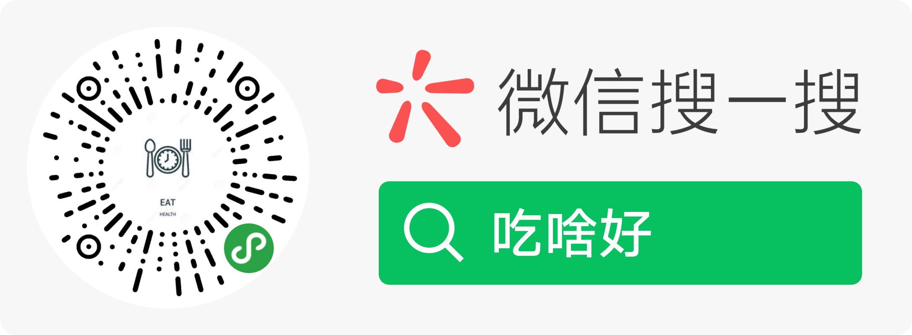

# eat

”吃啥好“ 小程序



# Tech Stack

- [原生小程序框架](https://developers.weixin.qq.com/miniprogram/dev/reference)
- [小程序云开发](https://developers.weixin.qq.com/miniprogram/dev/wxcloud/basis/getting-started.html)

# Project Struct

```
├── snapshot // 屏幕快照
├── database // module 示例
├── scripts  // 工程化脚本
```

# Deploy

发送 PR，然后添加 `preview` 标签，会自动部署到预览环境，确认无误后提交审核。

审核通过合并代码，GitHub Release。小程序后台/小程序助手 上全量发布。

# Models

Define Some model fields type base on [wxcloud database](https://developers.weixin.qq.com/miniprogram/dev/wxcloud/guide/database/data-type.html)

```typescript
Restaurant {
  name: string
  cover: string
  score: number
  recommend: string
  posters: string[]
  location: string[]  // Geo
}
```
